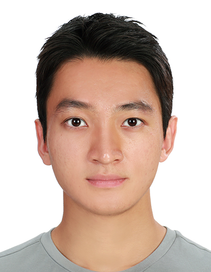

# Lee Jun Hyuk (이준혁) Profile

|       |       |
| ----- | ------|
| | |

---
## Interests
Artificial Intelligence  
Computer Vision  
Computer Graphics  
Data Science  
Biomechanics  
Sports Science  
Sports Engineering  
Chaos  
Nonlinear Dynamics  
Algorithms

---
## Education
    Mar 2018 ~ Aug 2023     Seoul National University Sports Science Major
    Mar 2022 ~ Aug 2023     Seoul National University Artificial Intelligence Major

---
## Career
    Jul 2020 ~ ing          Seoul National University Sports Engineering Lab Intern
    Oct 2021 ~ Feb 2022     Quve Seventeen AI team Research Engineer
    Jan 2023 ~ Feb 2023     NCSOFT Vision AI Lab Recognition Team Intern
온더스포츠 크루
대명 킬러웨일즈 마케터

---
## Research
논문 2개

---
## Certificate
    Dec 2020                Tensorflow Developer Certificate
    Dec 2022                생활스포츠지도사
    May 2023                COS Pro 1급
    Jun 2023                SW 코딩자격
    Jun 2023                파이썬마스터 1급

---
## Etc.
    Sep 2018                창단
    Sep 2018 ~ Jan 2021     초대 주장
    Sep 2018 ~ ing          서울대학교 아이스하키부
